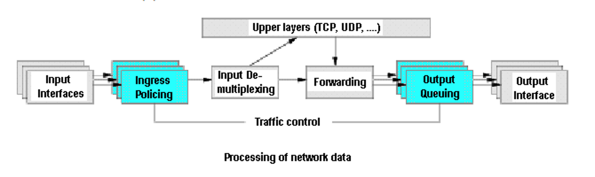

# kntool
[README_EN](README.md)

基于 Kubernetes 的 Admission controller webhook 机制的混沌网络测试工具。


## 使用
### 架构


### 部署
```shell
# deploy kntool
make image
make deploy
kubectl label name test-ns kntool-inject=enabled

# deploy test app
kubectl apply app.yml or helm insall ...
```

### 测试
```shell
kubectl get pod test-pod-name -o yaml | grep podIP
ping podIP
curl podIP:2332/latency/100ms
ping podIP
```

### TODO
- [ ] 抽象 tc 接口，支持多种实现  
- [ ] 实现 Server Client 注册交互  
- [ ] 实现 Server Dashboard  

## Traffic control with TC

### 什么是 Traffic control ？
流量控制（Traffic Control， tc）是 Linux 内核提供的流量限速、整形和策略控制机制。
它以 `qdisc-class-filter` 的树形结构来实现对流量的分层控制。

在 Debian 中，tc 命令工具与 iproute2 软件包捆绑在一起：
```shell
apt-get install iproute2
```

### Traffic control 功能
### Traffic control 原理
  
Linux 操作系统中的流量控制器 TC（Traffic Control）用于 Linux 内核的流量控制， 主要是通过在输出端口
处建立一个队列来实现流量控制。 Linux 流量控制的基本原理如下图所示。接收包从输入接口（Input Interface）
进来后， 经过流量限制（Ingress Policing）丢弃不符合规定的数据包， 由输入多路分配器（Input De-Multiplexing）
进行判断选择：如果接收包的目的是本主机， 那么将该包送给上层处理；否则需要进行转发，将接收包交到转发块
（Forwarding Block）处理。 转发块同时也接收本主机上层（TCP、UDP 等）产生的包。转发块通过查看路由表，
决定所处理包的下一跳。 然后，对包进行排列以便将它们传送到输出接口（Output Interface）。 一般我们只能限制网卡
发送的数据包，不能限制网卡接收的数据包，所以我们可以通过改变发送次序来控制传输速率。

### Traffic Control 流量控制方式
流量控制包括一下几种方式：  
* `Shaping`（整形）：交通成形时，其传输速度受到控制。整形可能不仅仅是降低可用带宽 - 它还可以用来消除流量突发，实现更好的网络行为。在出口处形成整形。  
* `Scheduling`（调度）：通过调度数据包的传输，可以在带宽范围内，按照优先级分配带宽。只适于向外的流量。  
* `Policing`（策略）：用于处理接收到的数据。  
* `Dropping`（丢弃）：如果流量超过某个设定的带宽，就丢弃数据包，不管是向内还是向外。  
* `Marking`（标记）

### Traffic Control 控制对象
流量的处理由三种对象控制，它们是：`qdisc`（排队规则）、`class`（类别）和 `filter`（过滤器）。

* `qdisc` 通过队列将数据包缓存起来，用来控制网络收发的速度。分为无类别和有类别。
* `class` 用来表示控制策略
* `filter` 用来将数据包划分到具体的控制策略中

### Traffic control 之 TC 命令使用
```shell
# 增加网络延时
sudo tc qdisc add dev eth0 root netem delay 1000ms

# 查看流量管理
tc qdisc show

# 删除策略
sudo tc qdisc del dev eth0 root netem delay 1000ms

# 测试
ping 10.244.0.52 -c 10

# 模拟延迟波动
tc qdisc add dev eth0 root netem delay 100ms 10ms
# 该命令将 eth0 网卡的传输设置为延迟 100ms ± 10ms (90 ~ 110 ms 之间的任意值)发送。还可以更进一步加强这种波动的随机性。

# 延迟波动随机性
tc qdisc add dev eth0 root netem delay 100ms 10ms 30%
# 该命令将 eth0 网卡的传输设置为 100ms，同时大约有 30% 的包会延迟 ± 10ms 发送。

# 模拟网络丢包
tc qdisc add dev eth0 root netem loss 1%

# 模拟包重复
tc qdisc add dev eth0 root netem duplicate 1%
# 该命令将 eth0 网卡的传输设置为随机产生 1% 的重复数据包
```

## Admission controller

### 什么是 Admission controller
先说场景，如果我们需要在 pod 创建出来之前，对其进行配置修改或者检查，这部分工作如果放在 APIServer 里，
需要管理员在 APIServer 中将其编译成二进制文件，如果配置修改想做成自定义的形式会非常麻烦。而 
Admission controllers 就是为这种场景而生的工具，以插件的形式附着到 APIServer 中，`AdmissionWebhooks` 
就是其中一种准入插件。

K8s 的 AdmissionWebhooks 分两种：`MutatingAdmissionWebhook` 和 `ValidatingAdmissionWebhook`，
二者合起来就是一个特殊类型的 Admission controllers，一个处理资源更改，一个处理验证。

### 快速搭建一个 Admission controller 的步骤
#### 编写 MutatingWebhookConfiguration 定义
可参考如下定义：
```yaml
apiVersion: admissionregistration.k8s.io/v1
kind: MutatingWebhookConfiguration
metadata:
  name: name
  labels:
    app: kntool
webhooks:
  - name: mutating-kntool.loulan.me
    clientConfig:
      service:
        # 服务名称
        name: kntool
        # 租户
        namespace: "kntool"
        # 请求路径
        path: "/mutate"
      # 必须提供 CA Bundle 验证服务端证书
      caBundle: "$CA_BUNDLE"
    rules:
      # 监听的操作
      - operations: [ "CREATE", "UPDATE" ]
        apiGroups: [""]
        apiVersions: ["v1"]
        # 监听的资源
        resources: ["pods"]
    # 用户特定打上特定 label 租户才启用注入
    namespaceSelector:
      matchLabels:
        kntool-inject: enabled
    admissionReviewVersions: ["v1", "v1beta1"]
    sideEffects: None
    timeoutSeconds: 5
```
#### 编写 Webhook controller 实现


## Traffic Control 与云原生
通过 Kubernetes 的 Dynamic Admission Control 机制定义，在创建指定应用的时候，注入一个带有特权模式的 Pod。
这个特权模式的 Pod 带有 API 接口，可以通过 API 接口适配。然后结合可观测性的监控来优化应用。

## 混沌工程
### 混沌工程是什么？
Netflix 工程师创建了 Chaos Monkey，使用该工具可以在整个系统中在随机位置引发故障。
正如 GitHub 上的工具维护者所说："Chaos Monkey 会随机终止在生产环境中运行的虚拟机实例和容器。"
通过 Chaos Monkey，工程师可以快速了解他们正在构建的服务是否健壮， 是否可以弹性扩容，是否可以处理计划外的故障。

混沌工程是在分布式系统上进行实验的学科，目的是建立对系统承受生产环境中恶劣条件能力的信心。

## 参考资料
* [Traffic Control HOWTO](https://tldp.org/HOWTO/Traffic-Control-HOWTO/)
* [Github project go tc](https://github.com/florianl/go-tc)
* [Github project apache traffic control](https://github.com/apache/trafficcontrol)
* [Github project chaos mesh](https://github.com/chaos-mesh/chaos-mesh/tree/master/chaos-mesh/pkg/chaosdaemon/tc_server.go)